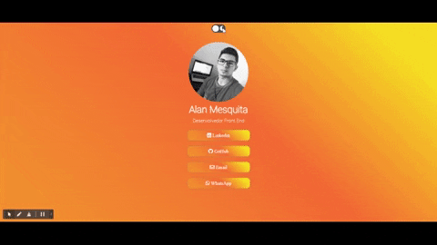
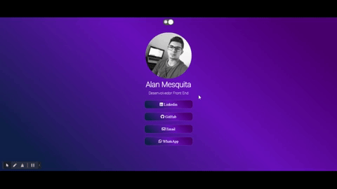
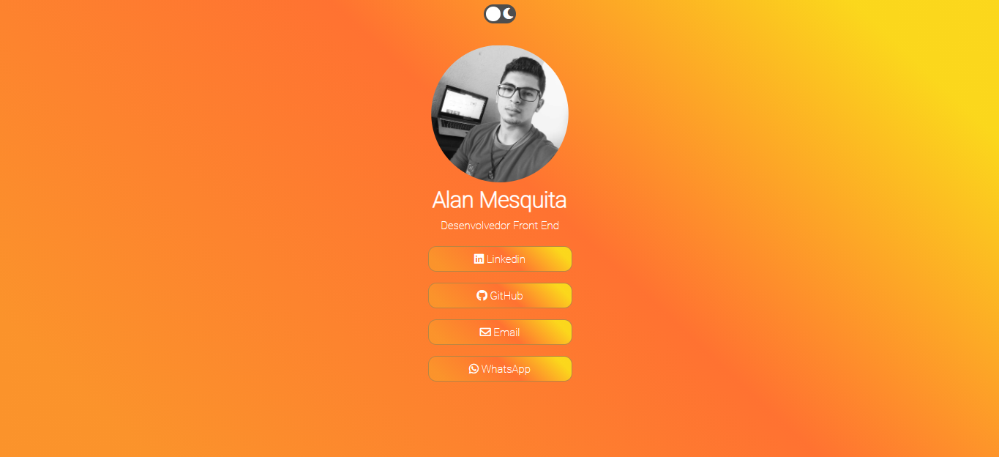
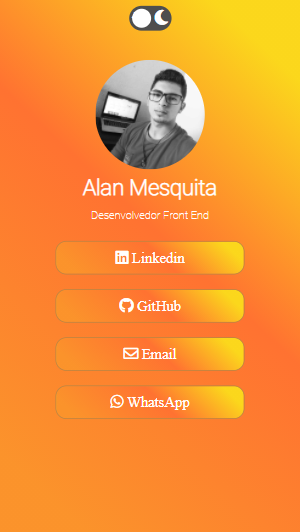
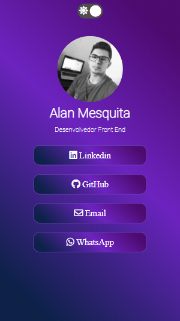

<h1 align="center">
  Clone LinkTree
</h1>

  <a href="#-tecnologias">Tecnologias</a>&nbsp;&nbsp;&nbsp;|&nbsp;&nbsp;&nbsp;
  <a href="#-projeto">Projeto</a>&nbsp;&nbsp;&nbsp;|&nbsp;&nbsp;&nbsp;
  <a href="#-layout">Layout</a>&nbsp;&nbsp;&nbsp;|&nbsp;&nbsp;&nbsp;

 

## 🚀 Tecnologias

Esse projeto foi desenvolvido com as seguintes tecnologias:

- HTML
- CSS
- JavaScript

## 💻 Projeto

Um LinkTree, ferramenta que disponibiliza para seus usuários uma página com todas as suas informações para serem compartilhadas com uma funcionalidade de modo claro e escuro adicionadas.

## 🔖 Layout

    
    
  

## Versão Web:

 
    
    
 

## Versão Mobile:

 

    
    

---
